# Ideaface质面未来 - AI模拟面试智能体

## 项目信息

项目名称: Ideaface质面未来 - AI模拟面试智能体

文档版本: 最终版

创建日期: 2025年8月8日

创建人: Nebula团队

***\*目录\****

[Ideaface质面未来 - AI模拟面试智能体 ](#_Toc205755610)

[项目信息 ](#_Toc205755611)

[1. 引言 ](#_Toc205755612)

[1.1. 项目背景与愿景 ](#_Toc205755613)

[1.2. 项目目标 ](#_Toc205755614)

[1.2.1. 主要目标 ](#_Toc205755615)

[1.2.2. 次要目标 ](#_Toc205755616)

[1.3. 项目范围 ](#_Toc205755617)

[1.3.1. 核心功能模块 (Core Functional Modules) ](#_Toc205755618)

[1.3.2. 辅助功能模块 (Auxiliary Functional Modules) ](#_Toc205755619)

[1.4. 目标用户 ](#_Toc205755620)

[1.4.1. 核心用户 (Primary Target Audience) ](#_Toc205755621)

[1.4.2. 扩展用户 (Secondary Target Audience) ](#_Toc205755622)

[1.4.3. 潜在用户 (Potential B2B Audience) ](#_Toc205755623)

[2. 系统架构 ](#_Toc205755624)

[2.1. 总体架构 ](#_Toc205755625)

[2.1.1. 架构模式与组件 ](#_Toc205755626)

[2.1.2. 关键设计决策：异步处理 ](#_Toc205755627)

[2.2. 前端技术栈 ](#_Toc205755628)

[2.3. 后端技术栈 ](#_Toc205755629)

[3. 功能模块详述 ](#_Toc205755630)

[3.1. 用户中心模块 (User Center Module) ](#_Toc205755631)

[3.1.1. 功能概述 ](#_Toc205755632)

[3.1.2. 核心子功能 ](#_Toc205755633)

[3.1.3. 业务流程 ](#_Toc205755634)

[3.1.4. 关键技术点 ](#_Toc205755635)

[3.2. AI模拟面试模块 (AI Mock Interview Module) ](#_Toc205755636)

[3.2.1. 功能概述 ](#_Toc205755637)

[3.2.2. 核心子功能 ](#_Toc205755638)

[3.2.3. 业务流程 ](#_Toc205755639)

[3.2.4. 关键技术点 ](#_Toc205755640)

[3.3. 面试评估报告模块 (Assessment Report Module) ](#_Toc205755641)

[3.3.1. 功能概述 ](#_Toc205755642)

[3.3.2. 核心子功能 ](#_Toc205755643)

[3.3.3. 业务流程 ](#_Toc205755644)

[3.3.4. 关键技术点 ](#_Toc205755645)

[3.4. 学习与练习模块 (Learning & Practice Module) ](#_Toc205755646)

[3.4.1. 功能概述 ](#_Toc205755647)

[3.4.2. 核心子功能 ](#_Toc205755648)

[3.4.3. 业务流程 ](#_Toc205755649)

[3.4.4. 关键技术点 ](#_Toc205755650)

[3.5. 博客论坛模块 (Blog & Forum Module) ](#_Toc205755651)

[3.5.1. 功能概述 ](#_Toc205755652)

[3.5.2. 核心子功能 ](#_Toc205755653)

[3.5.3. 业务流程 ](#_Toc205755654)

[3.5.4. 关键技术点 ](#_Toc205755655)

[4. 数据库设计 ](#_Toc205755656)

[4.1 E-R 图 ](#_Toc205755657)

[4.2 核心表结构说明 ](#_Toc205755658)

[5. API接口文档 ](#_Toc205755659)

[6. 部署与维护 ](#_Toc205755660)

[7. 未来规划 ](#_Toc205755661)

[7.1. 近期规划 (Phase 1: Content Discovery & Engagement Enhancement) ](#_Toc205755662)

[7.1.1. 高级全文搜索 (Advanced Full-Text Search) ](#_Toc205755663)

[7.1.2. 实时通知系统 (Real-time Notification System) ](#_Toc205755664)

[7.2. 中期规划 (Phase 2: Personalization & Socialization) ](#_Toc205755665)

[7.2.1. 内容推荐系统 (Content Recommendation System) ](#_Toc205755666)

[7.2.2. 用户社交体系 (Social Graph System) ](#_Toc205755667)

[7.3. 长期规划 (Phase 3: Operational Excellence & Commercialization) ](#_Toc205755668)

[7.3.1. 后台管理系统 (Admin Panel) ](#_Toc205755669)

[7.3.2. B2B企业服务 (Enterprise Services) ](#_Toc205755670)

 

# 1. 引言

 

### 1.1. 项目背景与愿景

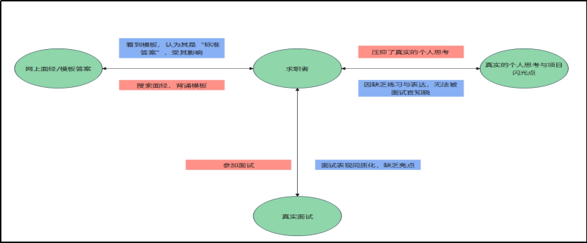对大多数大学生来说，正式面试机会稀缺且成本高（一旦表现不好可能直接错失 offer），而校园招聘会、企业宣讲会的模拟面试往往名额有限、覆盖面窄。我们急需一个能让自己 “大胆犯错” 的场景 —— 不用害怕给面试官留下坏印象，还能在试错中积累经验，这是制作软件的核心动机之一。而且如果有了面试的机会，大学生在面对面试也常感到迷茫：不知道不同岗位（如技术岗、运营岗、文职岗）的面试官关注什么，不清楚 “自我介绍”“项目经历描述”“职业规划” 等问题的回答逻辑，更难判断自己的表达是否得体。而我们的AI模拟面试在这个时候就能发挥很大的作用，帮我们拆解不同场景的面试要点，给那些在面试时会感到紧张的同学一个不断试错和培养自信的平台。这些都是我们制作这个软件的初心，希望他们可以借助我们这个平台解决一些面试的难点，越来越好。

 

图1-1 当代求职者难处

## 1.2. 项目目标

### 1.2.1. 主要目标

打造一个集成了高级AI面试官智能体的求职赋能平台，为用户提供高度拟真、可量化评估、并能提供个性化学习路径的完整服务闭环，成为求职者面试准备的首选工具。

### 1.2.2. 次要目标

***\*高可用性:\**** 保证核心服务99.9%的可用性，实现系统故障的快速恢复。

***\*高性能:\****确保用户交互的低延迟，常规API响应时间低于500ms，AI相关操作响应时间控制在5秒内。

***\*高可维护性:\****通过清晰的单体分层架构，实现模块解耦，降低代码复杂度，提升迭代效率。

***\*高安全性:\****全面保障用户数据的机密性、完整性和可用性，防范主流网络安全威胁。

***\*可扩展性:\****架构设计需具备前瞻性，能够在未来业务量增长时，平滑地从单体演进至微服务架构。

## 1.3. 项目范围

本项目的功能边界旨在围绕“AI赋能的求职准备”这一核心价值进行构建，确保核心功能的深度与专业性，同时通过辅助功能构建一个完整的用户体验闭环。项目范围明确划分为***\*核心功能模块\****与***\*辅助功能模块\****两大类。

### 1.3.1. 核心功能模块 (Core Functional Modules)

核心功能模块是《Ideaface质面未来》项目的基石，直接体现了产品的主要价值主张。所有开发资源将优先保证这些功能的稳定性、拟真度与智能化水平。

#### **AI模拟面试 (AI-Powered Mock Interview)**

**o** ***\*岗位适配性\****: 系统需支持多种预设的求职岗位（如后端开发、人工智能工程师等），并能根据用户选择的岗位动态调整面试流程与问题。

**o** ***\*简历驱动\****: 支持用户上传个人简历（PDF, DOCX格式），系统需能解析简历关键信息，并基于简历内容生成个性化的追问式面试题。

**o** ***\*多模态交互\****: 实现基于WebRTC的实时音视频流交互。用户通过摄像头和麦克风进行回答，系统需能捕捉用户的视频影像与音频数据。

**o** ***\*实时行为分析\****: 在前端通过 Face-api.js 等技术，对用户的视频流进行实时分析，捕捉面部表情、视线方向、头部姿态等非语言信号。

**o** ***\*智能追问与反馈\****: 后端集成大语言模型（LLM），根据用户的回答内容和实时行为数据，生成有针对性的追问以及对单题回答的实时简评。

#### **面试评估报告 (Interview Assessment Report)**

**o** ***\*异步生成机制\****: 为了优化用户体验，避免长时间等待，面试报告的深度分析将在后端通过异步任务完成。前端通过轮询机制获取最终报告。

**o** ***\*多维度能力评估\****: 系统需能从多个专业维度（如专业知识、逻辑思维、沟通表达、求职动机等）对用户的整体表现进行量化评分。

**o** ***\*数据可视化\****: 评估结果将以直观的能力雷达图形式呈现，帮助用户快速了解自身优势与短板。

**o** ***\*智能化反馈\****: 报告需包含由LLM生成的、具有建设性的***\*综合评语\****、***\*亮点表现总结\****以及具体可行的***\*AI改进建议\****。

**o** ***\*完整过程回顾\****: 报告将提供完整的面试对话记录，包括所有问题、用户的回答以及AI的单轮简评，方便用户复盘。

### 1.3.2. 辅助功能模块 (Auxiliary Functional Modules)

辅助功能模块旨在为核心功能提供支撑，并构建一个围绕求职准备的生态系统，以提升用户粘性和留存率。

#### **用户认证与管理系统 (User Authentication & Management System)**

o 提供完整的用户生命周期管理，包括注册（支持自定义头像上传）、登录、登出。

o 基于Spring Security + JWT实现安全的、无状态的API认证。

o 提供个人中心，允许用户查看和修改个人资料（用户名、邮箱、密码），并能查看自己的面试历史和博客文章列表。

#### **题库与算法在线练习 (Question Bank & Algorithm Practice)**

o 内置一个结构化的面试题库，支持按岗位分类和难度进行筛选。

o 提供一个基础的在线编程环境（IDE），用户可以进行在线算法题练习，并获得即时的是非结果反馈。

#### **学习中心资源聚合 (Learning Center Resource Aggregation)**

o 为不同求职方向的用户提供结构化的学习路线建议。

o 聚合和展示来自外部的高质量课程或文章资源，为用户弥补知识短板提供指引。

#### **博客论坛社区 (Blog & Forum Community)**

o 提供一个功能完备的Markdown内容创作与分享平台，支持图片上传和代码高亮。

o 通过分类、标签、点赞、嵌套评论、热榜等功能，促进用户之间的知识分享与互动。

o 为每个用户提供一个公开的个人主页，展示其创作内容，构建社区内的个人品牌。

 

## 1.4. 目标用户

为确保产品设计与市场策略的精准性，《Ideaface质面未来》项目的目标用户群体被划分为三个层次：核心用户、扩展用户与潜在用户。每个层次的用户具有不同的需求和使用场景，共同构成了产品的用户生态。

### 1.4.1. 核心用户 (Primary Target Audience)

核心用户是本项目最直接的服务对象，产品的所有核心功能均围绕其核心需求进行设计。

用户画像:

身份: 即将毕业或刚毕业的在校学生（本科、硕士、博士），以及拥有0-3年工作经验、正在寻求职业发展的社会人士。

特征:

求职动机强烈: 处于积极的求职周期中，有明确的面试需求。

理论知识相对扎实: 具备一定的专业知识基础，但在面试实战经验和技巧上相对匮乏。

反馈需求迫切: 渴望获得对自己面试表现的客观、即时且具有建设性的反馈，以快速迭代和提升。

数字化原生代: 对在线学习工具和智能化应用接受度高，习惯通过线上平台获取信息和提升技能。

核心痛点:

缺乏高质量、高拟真度的模拟面试机会。

“面试怯场”，面对压力情景容易紧张，难以发挥真实水平。

面试后无法获得有效的复盘和针对性的改进建议。

### 1.4.2. 扩展用户 (Secondary Target Audience)

扩展用户是产品的自然延伸市场，他们可能没有迫切的求职需求，但对个人职业发展有持续性的提升意愿。

用户画像:

身份: 拥有3年以上工作经验的资深技术人员、产品经理或中层管理者。

特征:

寻求内部晋升或更好的外部机会: 虽然不处于紧急求职状态，但希望为未来的职业变动做准备。

技能更新需求: 需要通过模拟面试来检验自己对新兴技术和行业方法论的掌握程度。

注重软技能提升: 关注沟通表达、逻辑思维、压力管理等综合素质的系统性提升。

核心痛点:

长期处于舒适区，面试“肌肉”有所退化。

难以找到合适的资深同行进行对练和交流。

希望通过系统性练习，将自己的项目经验和技术深度更好地在面试中呈现出来。

### 1.4.3. 潜在用户 (Potential B2B Audience)

潜在用户代表了项目未来的商业化扩展方向，主要面向企业级（B2B）市场。

用户画像:

身份:

企业人力资源部门 (HR): 负责初级岗位的大规模筛选和面试。

高等教育机构: 高校的就业指导中心、计算机学院等。

特征:

降本增效需求: 希望通过AI工具自动化部分初筛流程，降低人力成本，提升招聘效率。

标准化评估需求: 寻求一种更客观、标准化的方式来评估候选人的基础素质和岗位匹配度。

赋能学生需求: 高校希望为学生提供现代化的求职辅导工具，提升学生的就业竞争力。

核心痛-点:

初级岗位海量简历筛选和初面耗费大量人力。

人工面试官的状态和标准不一，导致评估结果存在主观偏差。

传统就业指导课程缺乏实战练习环节。

# 2. 系统架构

 

## 2.1. 总体架构

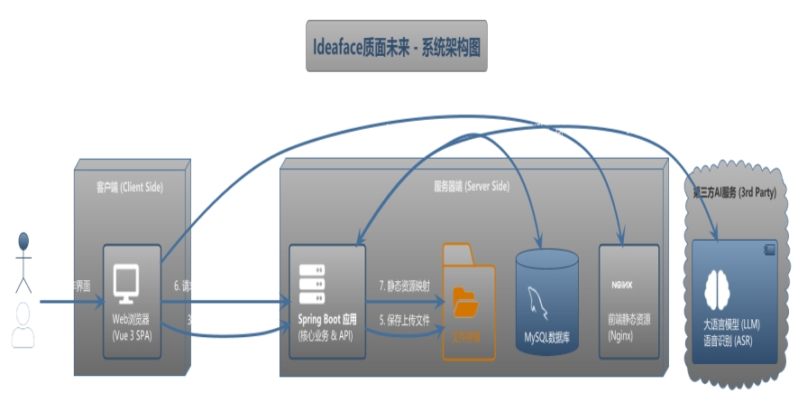 

图2-1 Ideaface质面未来系统架构图

本项目的总体架构遵循业界主流的***\*前后端分离（Headless）模式，旨在实现开发职责的清晰解耦、技术栈的灵活选型以及未来跨平台扩展的潜力。架构的核心设计原则包括高内聚、低耦合、可扩展性\****与***\*用户体验优先\****。

### 2.1.1. 架构模式与组件

**·** ***\*前端 (Frontend)\****: 采用 ***\*Vue 3 单页面应用 (SPA)\**** 模式。

**o** ***\*职责\****: 作为系统的“表示层 (Presentation Layer)”，全权负责所有用户界面的渲染、动态交互逻辑以及客户端状态管理。

**o** ***\*设计思想\****: 选择SPA模式可以在首次加载后提供接近原生应用的流畅体验，无需频繁刷新页面。Vue 3的Composition API则为构建复杂、可维护的UI组件提供了强大的支持。前端通过HTTP协议与后端进行纯粹的数据交换。

**·** ***\*后端 (Backend)\****: 采用 ***\*Spring Boot RESTful API 服务\**** 模式。

**o** ***\*职责\****: 作为系统的“业务逻辑层 (Business Logic Layer)”与“数据访问层 (Data Access Layer)”，负责处理所有核心业务逻辑、用户认证与授权、数据持久化，并作为中间层统一封装与第三方AI服务的复杂集成。

**o** ***\*设计思想\****: RESTful API作为无状态的通信标准，确保了前后端之间以及未来与其他潜在客户端（如移动App、小程序）之间通信的通用性和简洁性。Spring Boot的全家桶生态则为快速、稳健地开发企业级应用提供了坚实基础。

**·** ***\*数据流 (Data Flow)\****: 前后端之间严格通过定义好的API契约（API Contract）进行通信。前端发送HTTP请求，后端返回标准化的JSON格式数据，实现了表示层与业务逻辑的彻底分离。

### 2.1.2. 关键设计决策：异步处理

**·** ***\*实现方式\****: 项目中耗时最长的核心功能——面试报告的深度分析，采用了Spring Boot的 ***\*@Async 异步任务处理机制\****。

**·** ***\*设计思想 (为什么这么做)\****:

**o** ***\*用户体验优先\****: 直接在API请求的同步线程中调用大语言模型（LLM）进行深度分析，可能导致长达数十秒甚至数分钟的请求超时，这是不可接受的用户体验。

**o** ***\*系统解耦与弹性\****: 通过将分析任务放入独立的线程池中异步执行，API接口可以***\*立即响应\****前端，告知“报告正在生成中”，从而将长时间运行的任务与前端的主交互流程解耦。这种模式也为未来升级到更专业的**消息队列（Message Queue, 如RabbitMQ/Kafka）**进行削峰填谷和任务调度，预留了清晰的架构演进路径。

 

## 2.2. 前端技术栈

技术领域 所用技术/库  版本 用途说明
核心框架 Vue.js + TypeScript 3.x 构建用户界面的核心。
构建工具 Vite   5.x 提供极速的开发服务器和高效的打包构建。
UI 框架  Element Plus  2.x 提供高质量、统一风格的UI组件。
状态管理 Pinia   2.x 集中管理应用的用户登录状态等全局数据。
路由管理 Vue Router  4.x 管理应用的页面跳转和路由。
HTTP 请求 Axios          1.x 负责与后端API数据交互，通过拦截器实现JWT认证
实时分析 Face-api.js  0.22.x 在客户端进行实时的面部表情与行为识别。
富文本编辑 Vditor   3.9.x 提供功能强大的Markdown编辑器，支持图片上传。
代码高亮 highlight.js  11.x 用于美化文章和评论中的代码块。
图表库  ECharts   5.x 用于在面试报告中渲染能力雷达图。

## 2.3. 后端技术栈

技术领域 所用技术/框架  版本 用途说明
核心框架 Spring Boot  3.x 快速构建、部署和运行RESTful API服务。
开发语言 Java   21 提供现代化的语言特性和性能。
持久层  Spring Data JPA  3.x 简化数据库操作，通过Repository接口进行CRUD。
数据库  MySQL   8.x 关系型数据库，存储所有业务数据。
安全框架 Spring Security + JWT 6.x 处理用户认证与API授权。
AI集成  OkHttp / RestTemplate  调用第三方大语言模型（如讯飞星火）和语音识别服务
文件处理 Apache PDFBox, POI  用于解析用户上传的简历文件（PDF, DOCX）。

# 3. 功能模块详述

## 3.1. 用户中心模块 (User Center Module)

 

3.1.1. 功能概述
用户中心是整个平台的基础，为所有用户提供身份认证、个性化配置和活动记录追溯的能力。本模块旨在实现安全、可靠且用户友好的账户管理体系。

### 3.1.2. 核心子功能

**·** ***\*用户认证\****:

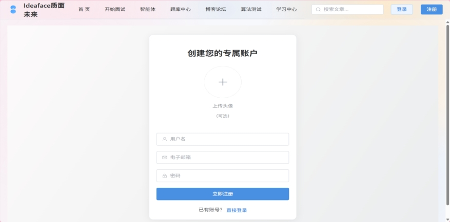 

图3-1 注册界面

 

**o** ***\*注册\****: 提供基于用户名、邮箱和密码的用户注册功能。支持用户在注册时上传自定义头像，若不上传则系统自动使用默认头像。

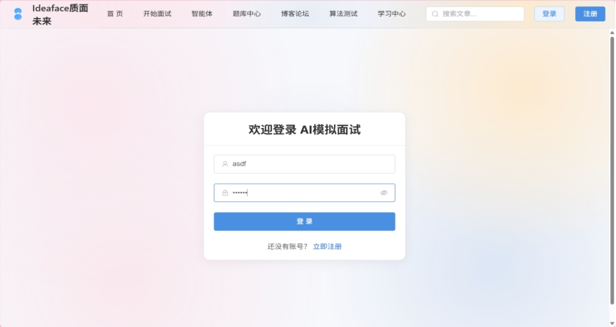 

图3-2 登录界面

**o** ***\*登录\****: 提供基于用户名和密码的登录认证。认证成功后，后端签发JWT (JSON Web Token)，前端负责持久化存储。

**o** ***\*无状态会话\****: 所有需认证的API均通过JWT进行无状态验证，提升了系统的可扩展性和安全性。

**·** ***\*个人资料管理\****:

 

图3-3 个人中心界面

**o** ***\*信息展示\****: 在个人中心页面展示用户的核心信息，包括头像、用户名、邮箱、用户ID及账户状态。

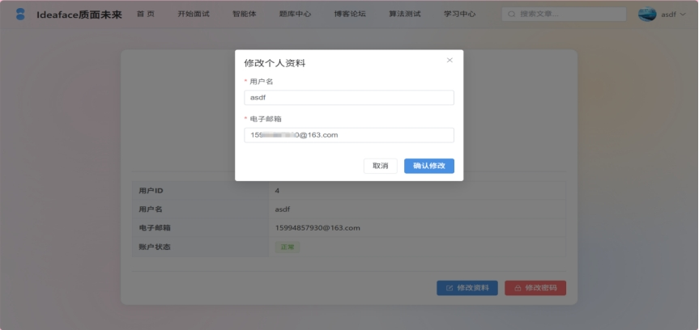 

图3-4 修改个人资料界面

**o** ***\*资料修改\****: 用户可修改其用户名和电子邮箱。系统会进行唯一性校验，防止冲突。

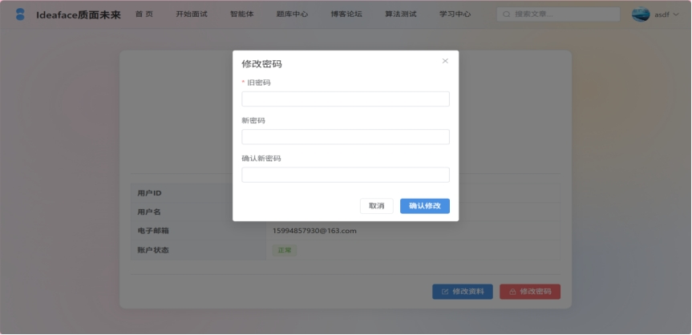 

图3-5 修改密码界面

**o** ***\*密码修改\****: 提供安全的密码修改流程，要求用户输入旧密码进行验证，并两次输入新密码进行确认。

 

图3-6 修改个人头像界面

**o** ***\*头像更换\****: 用户可随时点击头像，从本地上传新的图片作为自定义头像，或选择由系统重新随机生成一个风格化头像。

**·** ***\*活动记录\****:

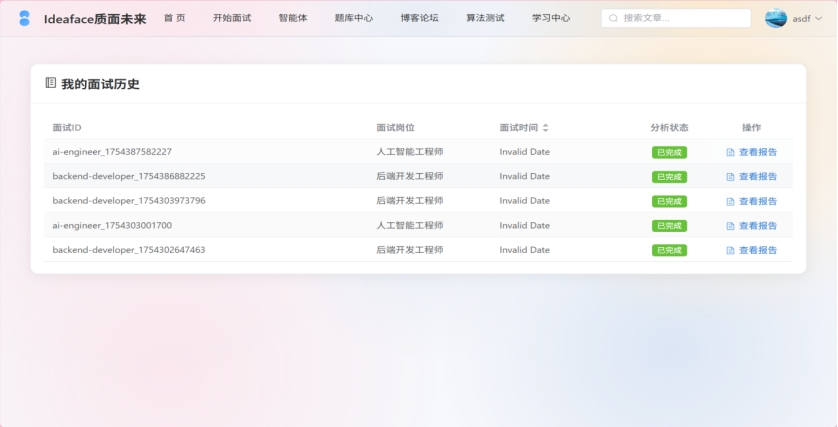 

图3-7 面试历史界面

**o** ***\*面试历史\****: 系统自动记录用户的每一次模拟面试会话。历史列表按时间倒序排列，并包含面试岗位、时间、分析状态等关键信息，提供入口跳转至对应的面试评估报告。

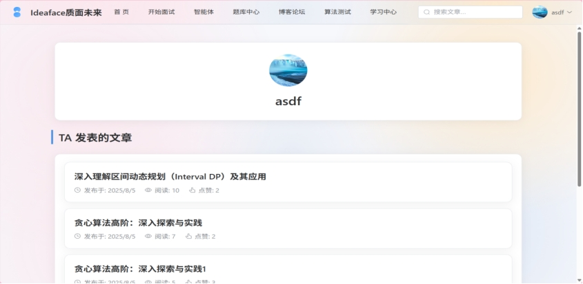 

图3-8 个人文章中心

**o** ***\*公开主页\****: 为每个用户生成一个公开的个人主页 (/user/:id)，集中展示该用户的公开信息（头像、用户名）及其在博客论坛发表的所有文章列表。

### 3.1.3. 业务流程

**1.** ***\*注册流程\****: 用户填写表单 -> 前端校验 -> （可选）选择头像文件 -> 提交 multipart/form-data -> 后端校验唯一性 -> 创建用户记录、加密密码 -> （处理头像）保存自定义头像或生成默认头像URL -> 返回成功响应。

**2.** ***\*登录流程\****: 用户填写表单 -> 提交 -> 后端验证凭据 -> 验证成功 -> 生成JWT -> 返回JWT及用户信息（包含头像URL） -> 前端持久化Token和用户信息。

**3.** ***\*认证访问流程\****: 前端通过Axios请求拦截器，在每个需认证的API请求头中自动附加 Bearer Token -> 后端通过Spring Security的JWT过滤器验证Token有效性 -> 验证通过则执行业务逻辑。

### 3.1.4. 关键技术点

**·** ***\*后端\****: Spring Security, JWT, BCryptPasswordEncoder, multipart/form-data处理。

**·** ***\*前端\****: Pinia (状态管理), Axios Interceptors (请求拦截), Vue Router (路由守卫)。

 

## 3.2. AI模拟面试模块 (AI Mock Interview Module)

 

3.2.1. 功能概述
这是产品的核心功能模块，旨在通过AI技术模拟真实的面试场景，为用户提供高质量的实战练习机会。

### 3.2.2. 核心子功能

**·** ***\*面试初始化\****:

 

**o** ***\*岗位选择\****: 用户从预设的岗位列表中选择一个作为本次面试的目标。

 

图3-9面试准备阶段

**o** ***\*简历驱动\****: 支持用户上传个人简历。后端通过Apache POI/PDFBox解析简历文本，并将其作为上下文，供后续LLM生成高度相关的面试问题。

**·** ***\*多模态交互\****:

**o** ***\*音视频通信\****: 通过浏览器WebRTC API获取用户的摄像头和麦克风权限，并在界面上实时显示用户影像。

**o** ***\*语音识别 (ASR)\****: 用户可通过语音进行回答。前端捕获音频流，（或后端处理）调用ASR服务，将语音实时转换为文字。

**·** ***\*智能面试流程\****:

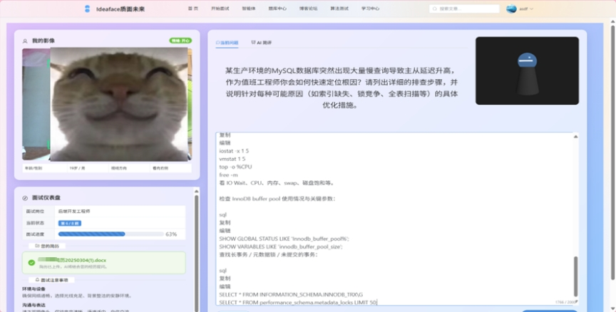 

图3-10 面试进行答题阶段

**o** ***\*动态问题生成\****: 后端根据用户的目标岗位和简历内容，调用LLM动态生成一套结构化、有梯度的面试问题（通常8-10题）。

**o** ***\*实时行为分析\****: 前端利用 Face-api.js 对用户的视频流进行实时分析，捕捉非语言信号（如情绪、视线）。

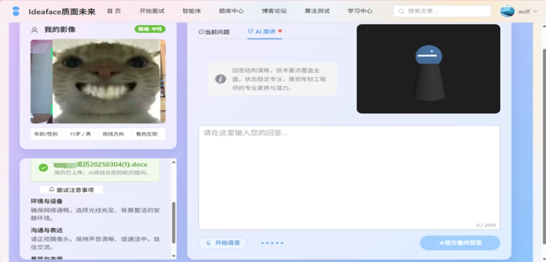 

图3-11 面试返回简评阶段

**o** ***\*逐题智能反馈\****: 用户每回答一个问题，前端将回答文本连同该时段的行为分析数据一并提交给后端。后端调用LLM，生成对本次回答的***\*实时简评\****，并返回下一道问题。

 

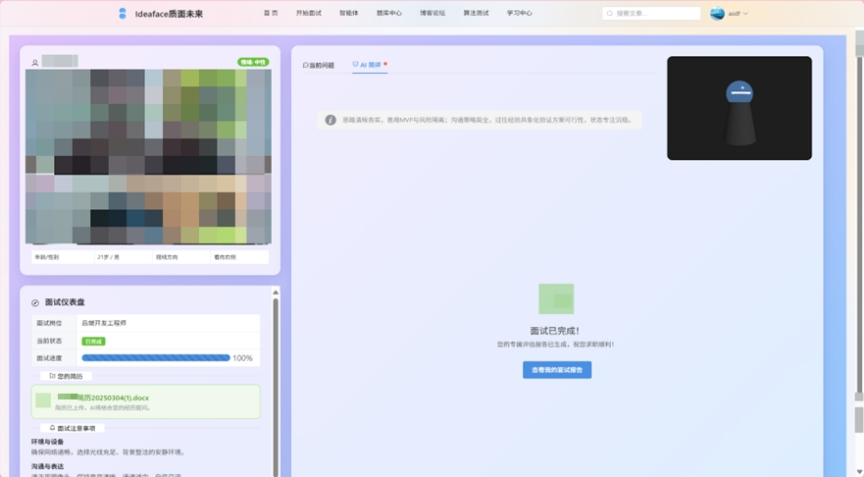 

图3-12 面试结束阶段

**o** ***\*面试结束\****: 所有问题回答完毕后，系统提示面试结束，并触发后续的深度报告生成流程。

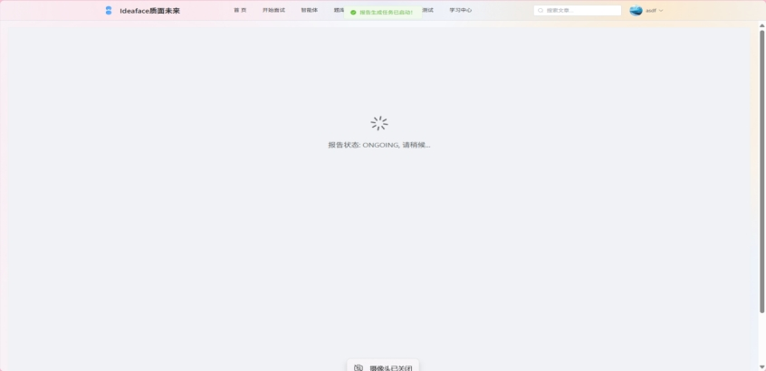 

图3-13 报告生成等待界面

### 3.2.3. 业务流程

1. 用户选择岗位 -> 上传简历 -> 后端解析并缓存简历文本。
2. 用户点击“开始面试” -> 后端调用LLM生成问题列表 -> 返回第一道问题。
3. 前端显示问题，并开始捕捉用户的音视频及行为数据。
4. 用户回答 -> 提交回答文本和行为数据 -> 后端调用LLM生成简评并获取下一题 -> 返回简评和下一题。
5. 重复步骤4，直至所有问题结束。
6. 最后一题回答完毕后 -> 后端返回最终简评及“面试结束”信号 -> 前端调用“结束面试”API，触发报告生成。

### 3.2.4. 关键技术点

**·** ***\*后端\****: OkHttp (LLM调用), ASR服务集成, Apache POI/PDFBox (简历解析)。

**·** ***\*前端\****: WebRTC (getUserMedia), Face-api.js, Web Speech API (可选, 用于前端ASR)。

 

## 3.3. 面试评估报告模块 (Assessment Report Module)

3.3.1. 功能概述
本模块旨在对用户的整体面试表现进行一次全面、深入、量化的复盘，提供具有高度价值的反馈，是产品的核心价值闭环。

### 3.3.2. 核心子功能

**·** ***\*异步生成\****: 报告分析是一个耗时过程。后端在接收到“结束面试”请求后，会立即返回响应，并将分析任务放入***\*异步线程池\****中执行，确保前端页面不会假死。

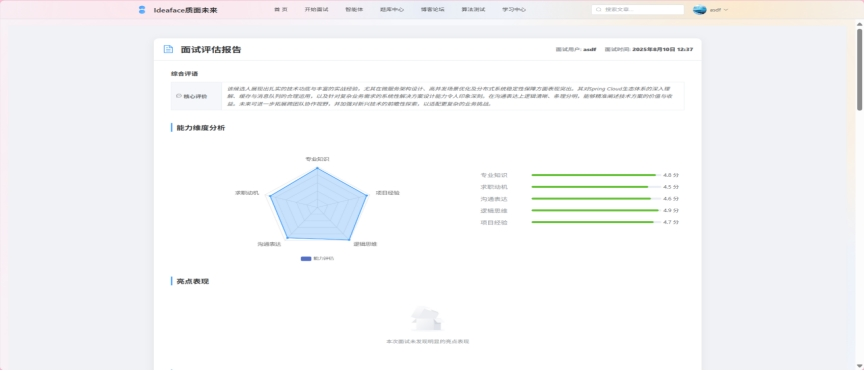 

图3-14 面试报告评估界面（1）

**·** ***\*多维度能力评估\****: 后端汇总用户的全部问答记录和行为数据，构建一个综合性的Prompt，请求LLM从多个维度（如专业知识、逻辑思维等）进行1-5分的量化评分。

**·** ***\*数据可视化\****: 前端使用ECharts等图表库，将后端返回的能力评分渲染成直观的***\*能力雷达图\****。

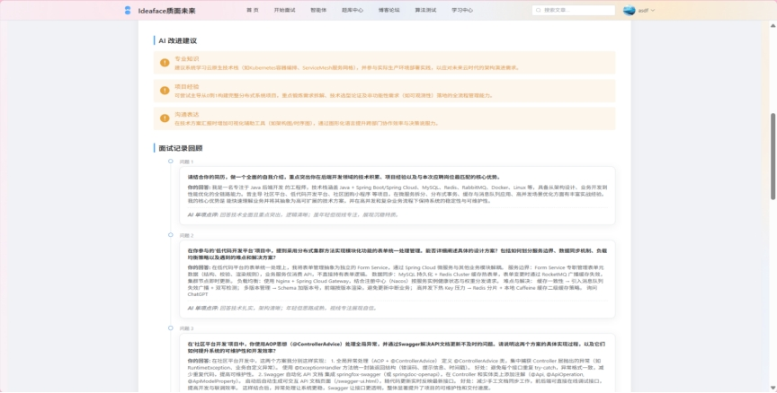 

图3-15 面试报告评估界面（2）

**·** ***\*深度AI反馈\****: 报告内容完全由LLM生成，包括：

**o** ***\*综合评语\****: 一段200字左右的、对用户整体表现的总结性评价。

**o** ***\*亮点表现\****: 明确列出用户在面试中表现突出的2-3个具体方面。

**o** ***\*改进建议\****: 针对用户的薄弱环节，提供3条以上具体、可执行的优化建议。

**·** ***\*面试复盘\****: 报告中包含本次面试的***\*完整对话记录\****，方便用户逐字逐句地回顾和反思。

### 3.3.3. 业务流程

1. 前端调用 POST /api/interviews/{sessionId}/end 接口。
2. 后端立即响应，并启动一个 @Async 异步任务。
3. 异步任务中，InterviewAnalysisService 汇总数据 -> 调用LLM -> 获取结构化的JSON分析结果 -> 将结果（评分、评语、建议等）存入 interview_report 表，并更新状态为 COMPLETED。
4. 前端跳转到报告页，通过***\*轮询\****机制，定时调用 GET /api/reports/{sessionId} 接口。
5. 当接口返回的报告 status 为 COMPLETED 时，前端停止轮询，获取完整报告数据并渲染页面。

### 3.3.4. 关键技术点

**·** ***\*后端\****: @Async (异步任务), Gson/Jackson (JSON解析), 精心设计的Prompt Engineering。

**·** ***\*前端\****: ECharts (图表), 定时器 (setInterval) 实现轮询。

## 3.4. 学习与练习模块 (Learning & Practice Module)

 

3.4.1. 功能概述
本模块旨在为用户提供一个围绕面试准备的、系统化的知识学习与技能实践平台。它作为AI模拟面试核心功能的有效补充，帮助用户在实战演练之外，针对性地弥补知识短板，形成“学习-练习-实战-反馈”的完整能力提升闭环。

### 3.4.2. 核心子功能

**·** ***\*题库中心 (Question Bank Center)\****

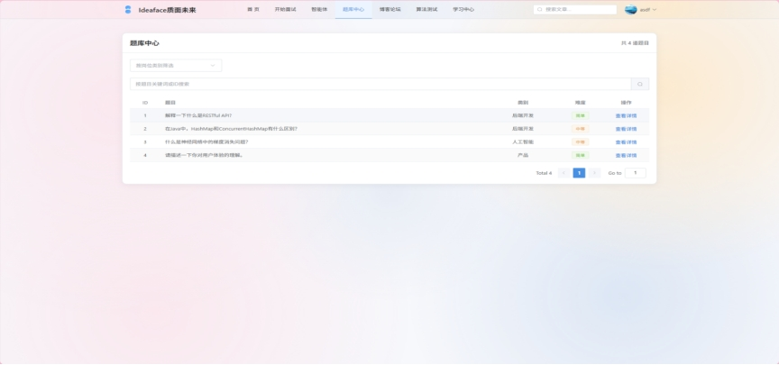 

图3-16 题库中心界面

**o** ***\*内容结构\****: 提供一个结构化的主观面试题库，覆盖多个技术和非技术领域（如后端开发、产品经理、通用能力等）。

**o** ***\*筛选与浏览\****: 用户可以按***\*岗位分类\****和***\*难度等级\****（如简单、中等、困难）对题库进行筛选，快速定位自己感兴趣或需要加强的题目。

**o** ***\*题目详情\****: 每个题目拥有独立的详情页，展示题目的完整描述和相关内容。

**o** ***\*社区讨论 (集成)\****: 题目详情页下方集成***\*社区评论功能\**** (QuestionComment)，允许用户围绕该题目发表自己的见解、解题思路或面试经验，形成学习和交流的氛围。

**·** ***\*算法测试 (Algorithm Practice)\****

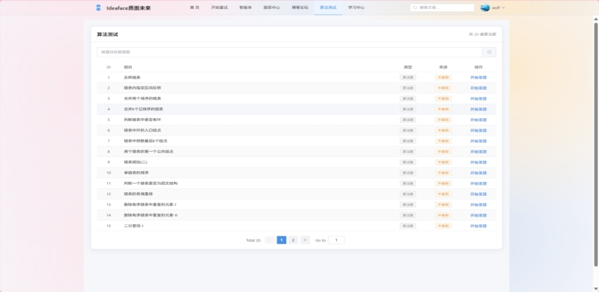 

图3-17 算法测试界面

**o** ***\*在线IDE\****: 提供一个基础的、支持主流编程语言（如Java, Python）的在线代码编辑器。

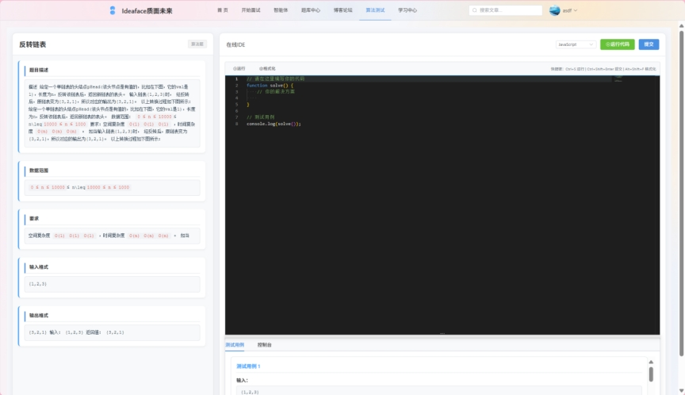 

图3-18算法挑战界面

**o** ***\*代码执行与评测\****: 集成第三方代码评测服务（如 Judge0），用户提交代码后，系统能够在线编译、运行代码，并根据预设的测试用例返回即时的结果（如“通过”、“解答错误”、“超时”等）。

**o** ***\*流程闭环\****: 为算法题的解答流程提供了完整的页面支持，包括答题页、成功页（展示执行用时、内存消耗）和失败页（展示错误详情）。

**·** ***\*学习中心 (Learning Center)\****

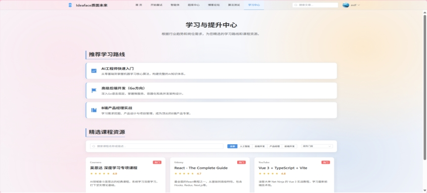 

图3-19 学习中心界面

**o** ***\*结构化学习路径\****: 为核心的求职方向（如AI工程师、后端开发）提供由专家预设的、系统化的***\*学习路线图\****，指导用户从基础到进阶进行学习。

**o** ***\*精选资源聚合\****: 聚合和展示来自互联网的高质量、免费的学习资源（如知名课程、经典博客、官方文档等）。每项资源都包含标题、简介、所属平台和直接跳转链接，为用户提供一站式的学习导航。

### 3.4.3. 业务流程

**1.** ***\*题库浏览流程\****: 用户进入题库中心 -> 选择分类/难度 -> 查看题目列表 -> 点击进入题目详情 -> 查看题目并参与下方评论。

**2.** ***\*算法练习流程\****: 用户进入算法测试 -> 选择题目 -> 进入在线IDE页面 -> 编写代码 -> 点击“运行”或“提交” -> 后端调用Judge0 API -> 返回评测结果 -> 前端根据结果跳转至成功或失败页面。

### 3.4.4. 关键技术点

**·** ***\*后端\****: Judge0 API集成, JPA Specification (用于题目动态筛选)。

**·** ***\*前端\****: 在线代码编辑器集成 (如 Monaco Editor, CodeMirror), 页面路由与状态管理。

 

## 3.5. 博客论坛模块 (Blog & Forum Module)

 

3.5.1. 功能概述
博客论坛模块是《Ideaface质面未来》的社区核心，旨在构建一个用户驱动的、围绕求职与技术成长的知识分享生态。它不仅为用户提供了展示个人技术品牌和分享经验的平台，也通过用户生成内容（UGC）极大地丰富了平台的信息价值。

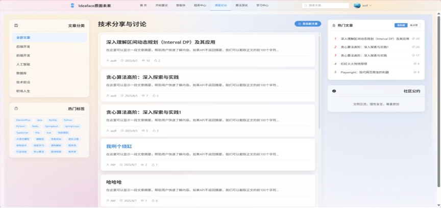 

图3-20 博客论坛社区

### 3.5.2. 核心子功能

**·** ***\*文章管理 (Post Management)\****

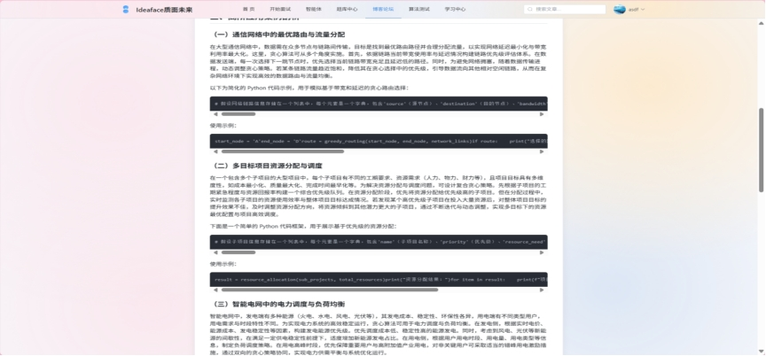 

图3-21 博客阅读

**o** ***\*富文本创作\****: 提供一个功能强大的、所见即所得的***\*Markdown编辑器 (Vditor)\****，支持标题、列表、引用、粗体/斜体等所有标准Markdown语法。

**o** ***\*多媒体支持\****: 实现***\*图片上传\****功能，用户可以将本地图片方便地插入文章中。支持***\*代码块高亮\****，为技术文章提供优秀的阅读体验。

**o** ***\*完整的CRUD操作\****: 支持文章的***\*创建 (Create)、读取 (Read)、更新 (Update)、删除 (Delete)\****。所有写操作（创建、更新、删除）均受权限保护，确保只有文章作者本人才能进行。

**·** ***\*内容组织 (Content Organization)\****

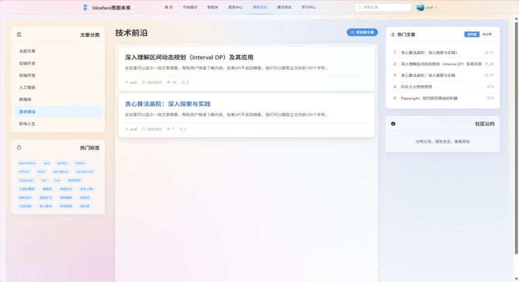 

图3-22 文章分类

**o** ***\*文章分类\****: 每篇文章必须归属于一个明确的***\*分类\****（如“后端开发”、“面试经验”），方便用户按主题进行结构化浏览。

**o** ***\*文章标签\****: 每篇文章可以附加多个***\*标签\****（如“SpringBoot”, “高并发”），提供更灵活、多维度的内容聚合方式。用户在发布时可以从现有标签中选择，也可以创建新标签。

**·** ***\*内容发现 (Content Discovery)\****

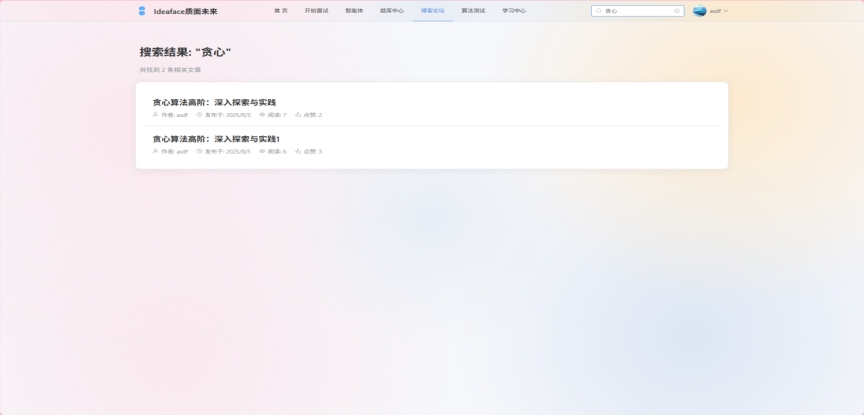 

图3-23 文章搜索

**o** ***\*多维度筛选\****: 在博客主页，用户可以通过点击侧边栏的分类或标签，对文章列表进行动态筛选。

**o** ***\*全文搜索\****: 提供一个基础的、基于关键词的***\*全文搜索\****功能，能够同时匹配文章的标题和内容。

**o** ***\*可切换热榜\****: 在侧边栏提供一个“热门文章”榜单，并支持用户在**“按综合热度（点赞+阅读）”***\*和\****“按点赞数”**两种排序模式之间进行切换。

**·** ***\*互动系统 (Interaction System)\****

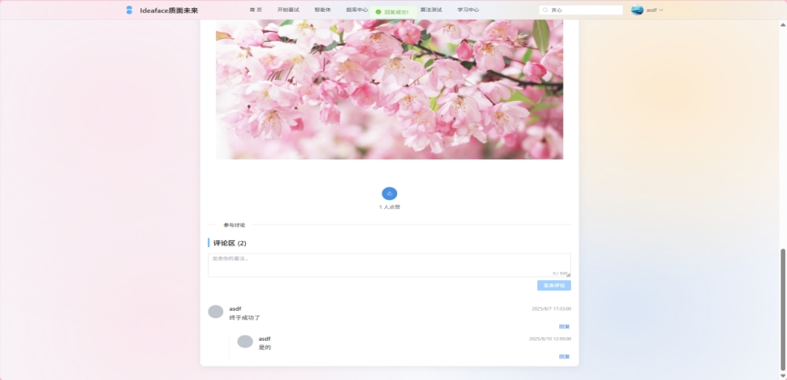 

图3-24 评论区互动

**o** ***\*点赞\****: 用户可以对喜欢的文章进行点赞，作为最直接的支持和反馈。系统会记录点赞关系，防止重复点赞。

**o** ***\*嵌套评论\****: 提供一个支持***\*二级及多级回复\****的评论系统。用户不仅可以对文章发表评论，还可以针对某一条评论进行回复，形成对话式的讨论。

### 3.5.3. 业务流程

**1.** ***\*发布流程\****: 用户点击“发表新文章” -> 进入创作页面 -> 填写标题、选择分类、添加标签 -> 在Vditor编辑器中撰写内容并上传图片 -> 提交 -> 后端校验并保存 -> 跳转至新文章的详情页。

**2.** ***\*浏览与互动流程\****: 用户进入博客主页 -> 通过分类/标签/热榜/搜索发现文章 -> 点击进入文章详情页 -> 阅读文章 -> 进行点赞或在下方评论区发表/回复评论。

### 3.5.4. 关键技术点

**·** ***\*后端\****: multipart/form-data (图片上传), JPA Specification (多条件筛选), 自定义JPQL查询 (热榜排序)。

**·** ***\*前端\****: Vditor (Markdown编辑器), marked + highlight.js (Markdown内容渲染), 递归组件 (嵌套评论)。

 

# 4. 数据库设计

### 4.1 E-R 图

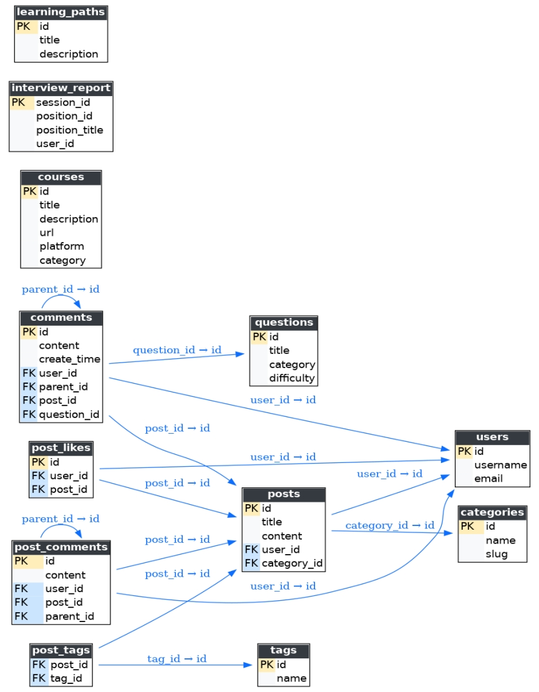 

图4-1 E-R图

### 4.2 核心表结构说明

#### **4.2.1. users - 用户信息表**

***\*表描述\****:
users 表是整个系统的身份认证与用户数据的基础。它存储了所有注册用户的基础信息、认证凭据以及个性化配置。

***\*表结构定义\****:

codeSQL

CREATE TABLE `users` (

 `id` BIGINT NOT NULL AUTO_INCREMENT COMMENT '用户唯一标识符 (主键)',

 `username` VARCHAR(255) NOT NULL COMMENT '用户名, 必须唯一',

 `email` VARCHAR(255) NOT NULL COMMENT '电子邮箱, 必须唯一, 用于登录和通知',

 `password` VARCHAR(255) NOT NULL COMMENT '加密后的用户密码 (使用BCrypt)',

 `avatar` VARCHAR(255) NULL DEFAULT NULL COMMENT '用户头像的URL',

 `avatar_type` VARCHAR(20) NOT NULL DEFAULT 'generated' COMMENT '头像类型: generated(自动生成) 或 custom(用户上传)',

 PRIMARY KEY (`id`),

 UNIQUE KEY `UK_username` (`username`),

 UNIQUE KEY `UK_email` (`email`)

) ENGINE=InnoDB COMMENT='用户信息表';

 

 

 

 

***\*关键字段说明\****:

| 字段名      | 类型         | 约束             | 描述                                                 | 设计思想                                                     |
| ----------- | ------------ | ---------------- | ---------------------------------------------------- | ------------------------------------------------------------ |
| Id          | BIGINT       | PK, AI           | 用户ID: 系统的唯一数字标识符。                       | 作为所有其他业务表（如posts, comments）的外键，使用数字类型比字符串类型查询效率更高。 |
| Username    | VARCHAR(255) | NOT NULL, UNIQUE | 用户名: 用于登录和在社区中展示。                     | 设置为唯一，是用户的核心身份标识之一。                       |
| Email       | VARCHAR(255) | NOT NULL, UNIQUE | 电子邮箱: 用于登录和接收通知（如密码重置）。         | 设置为唯一，确保账户安全和通信的准确性。                     |
| Password    | VARCHAR(255) | NOT NULL         | 密码: 存储经过BCrypt算法强加密后的密码哈希值。       | 绝不存储明文密码。使用BCrypt这类慢哈希算法可以有效抵御彩虹表和暴力破解攻击。 |
| Avatar      | VARCHAR(255) | NULL             | 头像URL: 存储指向用户头像图片的完整URL。             | 存储URL而非图片本身，实现了数据与资源的分离。允许为NULL，以便支持默认头像逻辑。 |
| avatar_type | VARCHAR(20)  | NOT NULL         | 头像类型: 标识头像是系统生成的还是用户自定义上传的。 | 为未来的功能扩展（如“头像挂件”）预留了设计空间。             |

图4-2 users表

#### **4.2.2. interview_report - 面试评估报告表**

***\*表描述\****:
interview_report 表是AI模拟面试功能的核心产出物。它持久化存储每一次面试会话的详细分析结果，包括由大语言模型（LLM）生成的结构化反馈数据。

***\*表结构定义\****:

codeSQL

CREATE TABLE `interview_report` (

 `session_id` VARCHAR(255) NOT NULL COMMENT '面试会话的唯一标识符 (主键)',

 `user_id` BIGINT NOT NULL COMMENT '参与面试的用户ID (外键)',

 `position_id` VARCHAR(255) NOT NULL COMMENT '面试岗位的标识符 (如 backend-developer)',

 `position_title` VARCHAR(255) NULL COMMENT '面试岗位的显示名称',

 `status` VARCHAR(255) NOT NULL DEFAULT 'ONGOING' COMMENT '报告状态 (ONGOING, ANALYZING, COMPLETED, FAILED)',

 `overall_comment` TEXT NULL COMMENT 'LLM生成的综合评语',

 `capability_analysis_json` JSON NULL COMMENT 'LLM生成的能力维度评分 (用于雷达图)',

 `improvement_suggestions_json` JSON NULL COMMENT 'LLM生成的改进建议列表',

 `highlights_json` JSON NULL COMMENT 'LLM生成的亮点表现列表',

 `dialogue_history_json` JSON NULL COMMENT '完整的对话历史记录',

 `create_time` DATETIME NOT NULL COMMENT '面试开始时间',

 PRIMARY KEY (`session_id`),

 KEY `idx_report_user_id` (`user_id`),

 CONSTRAINT `fk_report_user` FOREIGN KEY (`user_id`) REFERENCES `users` (`id`)

) ENGINE=InnoDB COMMENT='面试评估报告表';

 

 

 

 

***\*关键字段说明\****:

| ***\*字段名\**** | ***\*类型\**** | ***\*约束\**** | ***\*描述\****                                               | ***\*设计思想\****                                           |
| ---------------- | -------------- | -------------- | ------------------------------------------------------------ | ------------------------------------------------------------ |
| session_id       | VARCHAR(255)   | PK             | ***\*会话ID\****: 由前端生成的、标识一次面试会话的唯一字符串。 | 使用前端生成的ID可以方便地在整个会话生命周期中进行追踪，无需等待后端创建记录。 |
| user_id          | BIGINT         | NOT NULL, FK   | ***\*用户ID\****: 关联到 users 表，标识报告的所有者。        |                                                              |
| status           | VARCHAR(255)   | NOT NULL       | ***\*报告状态\****: 追踪报告的生成进度。                     | ONGOING: 面试进行中; ANALYZING: 正在异步分析; COMPLETED: 分析完成; FAILED: 分析失败。前端通过轮询此状态来更新UI。 |
| ..._json 字段    | JSON           | NULL           | ***\*结构化分析数据\****: 将LLM返回的复杂、嵌套的评估结果以JSON格式直接存储。 | 利用MySQL的JSON数据类型，可以高效地存储和查询半结构化数据，避免了创建过多关联表的复杂性，同时保持了数据的可读性和灵活性。 |
| create_time      | DATETIME       | NOT NULL       | ***\*创建时间\****: 记录面试的开始时间。                     |                                                              |

图4-3 interview_report表

#### **4.2.3. posts - 博客文章表**

***\*表描述\****:
posts 表是博客论坛模块的内容核心，用于存储用户发表的所有文章及其元数据。

***\*表结构定义\****:

codeSQL

CREATE TABLE `posts` (

 `id` BIGINT NOT NULL AUTO_INCREMENT COMMENT '文章唯一标识符 (主键)',

 `title` VARCHAR(255) NOT NULL COMMENT '文章标题',

 `content` LONGTEXT NOT NULL COMMENT '文章的Markdown原文内容',

 `user_id` BIGINT NOT NULL COMMENT '作者的用户ID (外键)',

 `category_id` BIGINT NULL COMMENT '文章所属分类的ID (外键)',

 `view_count` INT NOT NULL DEFAULT 0 COMMENT '文章浏览量',

 `like_count` INT NOT NULL DEFAULT 0 COMMENT '文章点赞数',

 `create_time` DATETIME(6) NOT NULL DEFAULT CURRENT_TIMESTAMP(6),

 `update_time` DATETIME(6) NOT NULL DEFAULT CURRENT_TIMESTAMP(6) ON UPDATE CURRENT_TIMESTAMP(6),

 PRIMARY KEY (`id`),

 KEY `idx_post_user_id` (`user_id`),

 KEY `idx_post_category_id` (`category_id`),

 CONSTRAINT `fk_post_user` FOREIGN KEY (`user_id`) REFERENCES `users` (`id`),

 CONSTRAINT `fk_post_category` FOREIGN KEY (`category_id`) REFERENCES `categories` (`id`)

) ENGINE=InnoDB COMMENT='博客文章表';

***\*关键字段说明\****:

| ***\*字段名\**** | ***\*类型\**** | ***\*约束\**** | ***\*描述\****                                               | ***\*设计思想\****                                           |
| ---------------- | -------------- | -------------- | ------------------------------------------------------------ | ------------------------------------------------------------ |
| id               | BIGINT         | PK, AI         | ***\*文章ID\****: 文章的唯一数字标识符。                     |                                                              |
| content          | LONGTEXT       | NOT NULL       | ***\*文章内容\****: 存储用户输入的***\*原始Markdown文本\****。 | ***\*存储原始Markdown而非渲染后的HTML\****，这使得文章内容可以被轻松地再次编辑，并且可以适应未来不同的渲染引擎或样式。 |
| user_id          | BIGINT         | NOT NULL, FK   | ***\*作者ID\****: 关联到 users 表，标识文章的作者。          | 建立了内容与创作者的明确关系。                               |
| category_id      | BIGINT         | NULL, FK       | ***\*分类ID\****: 关联到 categories 表（一对多关系）。       | 允许文章不属于任何分类（尽管UI上可能强制要求），为未来的灵活性做准备。 |
| view_count       | INT            | NOT NULL       | ***\*浏览量\****: 记录文章被查看的次数。                     | 通过在getPostById服务中递增此值，提供了一个衡量文章受欢迎程度的基础指标。 |
| like_count       | INT            | NOT NULL       | ***\*点赞数\****: 记录文章收到的点赞总数。                   | 这是一个***\*冗余字段\****，用于避免每次查询列表时都去 post_likes 表中进行COUNT(*)的昂贵操作，是典型的性能优化设计。 |

图4-4 posts表

# 5. API接口文档

本项目接口基于 OpenAPI 3.0 规范维护，已通过 Postman 导入并分类整理，方便调试与调用。
接口集合已分组为 user、posts、resume、interactive-interview 等模块，每个模块下包含具体的请求示例（含路径、请求方式、请求参数和返回结果）。

详细见附件：Interview Agent API.postman_collection.json

# 6. 部署与维护

本项目采用前后端分离架构，在本地开发环境中，通过两个独立的Node.js和Java进程协同运行，模拟了生产环境的基本交互模式。其部署架构如下图所示：

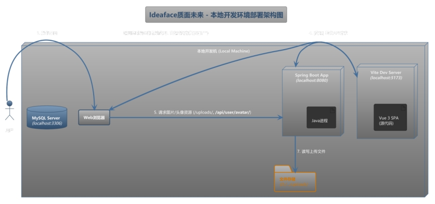 

图6-1 本体开发环境部署架构图

***\*图例说明\****:
上图展示了项目在单一开发者计算机上的运行与调试环境。所有服务均作为本地进程启动。

***\*数据流与工作流程\****:

**1.** ***\*前端访问\****: 开发者通过Web浏览器访问 http://localhost:5173。该请求由 ***\*Vite开发服务器\**** 处理。Vite会实时编译 src 目录下的Vue源代码，并将结果返回给浏览器，实现了极速的热更新（HMR）。

**2.** ***\*API请求代理 (开发时)\****: 当前端应用需要与后端进行数据交互时，它会向***\*自己的地址\****（http://localhost:5173）发起以 /api/ 开头的请求（例如 /api/posts）。Vite开发服务器根据 vite.config.ts 文件中的 proxy 配置，捕获这些请求，并将其***\*透明地转发\****到正在 http://localhost:8080 运行的 ***\*Spring Boot 应用\****。

**3.** ***\*后端处理\****: Spring Boot应用接收到来自Vite代理的请求后，执行相应的业务逻辑。

**o** ***\*数据库交互\****: 通过JDBC连接到本地的 3306 端口，与 ***\*MySQL数据库\**** 进行数据读写。

**o** ***\*文件操作\****: 将用户上传的图片等文件，直接写入到本地文件系统的指定目录中（例如 D:/interview-agent/uploads）。

**4.** ***\*静态资源访问\****: 对于图片、头像等已上传的静态资源，前端代码生成的URL是***\*指向后端\****的完整地址（如 http://localhost:8080/uploads/image.png）。浏览器会***\*直接向 localhost:8080 发起\****这些资源的GET请求，由Spring Boot的静态资源处理器 (WebConfig) 负责从本地磁盘返回文件。

这种本地部署模式通过Vite的代理功能，有效解决了开发过程中的跨域问题，并高度模拟了生产环境中通过Nginx进行反向代理的情景，为开发者提供了流畅、一致的开发体验。

 

# 7. 未来规划

为确保《Ideaface质面未来》项目的持续发展与长期竞争力，我们制定了以下功能迭代路线图。此规划旨在逐步深化产品的核心价值，拓展用户生态，并提升运营效率。功能按优先级分为近期、中期和长期三个阶段。

## 7.1. 近期规划 (Phase 1: Content Discovery & Engagement Enhancement)

***\*目标\****: 提升核心内容（博客）的发现效率和用户的互动体验。

### 7.1.1. 高级全文搜索 (Advanced Full-Text Search)

**o** ***\*业务价值\****: 当平台内容（特别是博客文章）积累到一定数量时，基础的数据库 LIKE 查询将无法满足用户对搜索速度和相关性的要求。引入专业搜索引擎是提升内容可发现性、将平台从“内容陈列”升级为“知识库”的关键一步。

**o** ***\*功能描述\****:

§ 在前端提供一个全局、响应迅速的搜索入口。

§ 支持对文章标题、内容、标签进行***\*多字段\****的关键词搜索。

§ 支持***\*中文分词\****，能更智能地理解用户意图（例如搜索“Spring启动”能匹配到“Spring Boot启动原理”）。

§ 搜索结果按***\*相关度\****进行智能排序。

**o** ***\*技术方向\****:

**§** ***\*后端\****: 集成 ***\*Elasticsearch\****。通过 spring-boot-starter-data-elasticsearch 依赖，实现数据在MySQL和Elasticsearch之间的同步。所有搜索请求将直接由Elasticsearch处理。

**§** ***\*部署\****: 在开发环境中使用Docker部署一个单节点的Elasticsearch实例。

### 7.1.2. 实时通知系统 (Real-time Notification System)

**o** ***\*业务价值\****: 实时通知是提升用户***\*社区归属感\****和***\*日活跃度 (DAU)\**** 的核心功能。即时反馈（如点赞、评论、回复）能极大地激励内容创作者，并促使用户更频繁地回访平台。

**o** ***\*功能描述\****:

§ 当用户的文章或评论被他人点赞、评论或回复时，用户能在导航栏看到一个实时的红点提示。

§ 点击通知图标，会弹出一个列表，展示最近的互动消息。

§ 点击单条通知，能直接跳转到对应的文章或评论位置。

**o** ***\*技术方向\****:

**§** ***\*后端\****: 集成 ***\*Spring Boot WebSocket\**** (spring-boot-starter-websocket)，为每个在线用户建立持久连接。当互动事件发生时，通过异步任务将通知消息推送给目标用户。

**§** ***\*前端\****: 使用原生的 WebSocket API 或 Stomp.js 库，与后端建立连接并监听消息。使用Pinia Store管理通知状态（如未读数量）。

## 7.2. 中期规划 (Phase 2: Personalization & Socialization)

***\*目标\****: 从“工具平台”向“社交化社区”演进，提升用户粘性。

### 7.2.1. 内容推荐系统 (Content Recommendation System)

**o** ***\*业务价值\****: 变“人找信息”为“信息找人”。通过个性化推荐，增加用户的平均浏览页数 (PV) 和停留时间，提升非热门内容的曝光机会。

**o** ***\*功能描述\****:

§ 在每篇文章详情页底部，展示一个“相关文章”模块。

§ 在博客主页，可以为登录用户提供一个“为你推荐”的信息流。

**o** ***\*技术方向\****:

**§** ***\*V1 (基于标签)\****: 实现一个基于共同标签数量的简单推荐算法。

**§** ***\*V2 (基于内容)\****: 引入 ***\*TF-IDF\**** 算法，通过计算文章关键词向量的***\*余弦相似度\****来推荐内容最相似的文章。

### 7.2.2. 用户社交体系 (Social Graph System)

**o** ***\*业务价值\****: 建立用户之间的连接，是社区形成和沉淀的关键。

**o** ***\*功能描述\****:

**§** ***\*关注系统\****: 用户可以关注自己欣赏的创作者。

**§** ***\*动态Feed流\****: 在博客主页，用户可以切换到“关注”信息流，只看自己关注的作者发布的最新文章。

**o** ***\*技术方向\****:

**§** ***\*后端\****: 新建 user_follows 关注关系表。开发关注/取关API。Feed流的实现需要进行高效的数据库查询设计（避免慢查询）。

## 7.3. 长期规划 (Phase 3: Operational Excellence & Commercialization)

***\*目标\****: 提升平台的可管理性和探索商业化可能性。

### 7.3.1. 后台管理系统 (Admin Panel)

**o** ***\*业务价值\****: 为平台运营人员提供一个高效管理平台内容的工具，是保障社区内容质量和处理违规行为的基础。

**o** ***\*功能描述\****:

§ 一个独立的、受严格权限保护的前端应用。

§ 支持对用户、文章、评论、分类、标签等所有核心数据的***\*增、删、改、查\****操作。

§ 提供数据看板，可视化分析平台的核心运营指标。

**o** ***\*技术方向\****:

**§** ***\*后端\****: 引入基于角色的访问控制 (RBAC)。在 User 实体中添加 roles 字段。使用 @PreAuthorize("hasRole('ADMIN')") 等注解保护所有管理后台API。

**§** ***\*前端\****: 可以使用 vue-element-admin 等成熟的后台管理模板快速搭建。

### 7.3.2. B2B企业服务 (Enterprise Services)

**o** ***\*业务价值\****: 探索项目的商业化路径。

**o** ***\*功能描述\****:

§ 为企业提供定制化的在线初筛面试服务。

§ 为高校提供批量学生账户管理和教学辅助功能。

**o** ***\*技术方向\****: 这将是一个全新的、需要进行详细市场调研和产品设计的独立模块。

 
